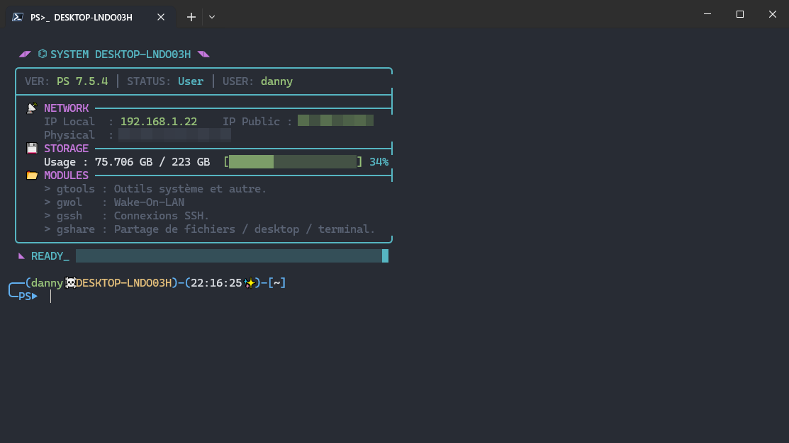

# My-Custom-PowerShell-Profile

Profil PowerShell personnalisé avec fonctions utilitaires, outils système et améliorations du terminal.



Ce dépôt contient mon **profil PowerShell personnalisé** (`$PROFILE` – `Microsoft.PowerShell_profile.ps1`) ainsi qu’un ensemble d’**outils, fonctions et alias** conçus pour améliorer :

- ✨ **Productivité**
- 🚀 **Confort d’utilisation**
- 🎨 **Esthétique du terminal**
- 🛠️ **Automatisation de tâches courantes**

Tous les outils sont **gratuits**, **ne requière aucune inscription**, et orientés **usage quotidien**.

---

## Aperçu des fonctionnalités

- Prompt personnalisé avec **icônes**, **couleurs dynamiques** et **statut de la dernière commande** (succès / échec)
- Bannière d’accueil affichant :
  - IP locale et publique
  - Adresse MAC
  - Espace disque avec barre de progression
- Mise à jour **automatique et asynchrone** du profil via Git
- Notifications **sonores et vocales** (session interactive locale uniquement)
- Alias organisés par **groupes thématiques**
- **Aide-mémoire intégré** pour les commandes système utiles

---

## Organisation des alias

Les alias sont regroupés par catégories logiques :

| Groupe   | Description |
|----------|-------------|
| `gtools` | Outils système & fonctions utilitaires |
| `gwol`   | Réveil réseau (Wake-on-LAN) |
| `gssh`   | Connexions SSH prédéfinies |
| `gshare` | Partage de fichiers, services et sessions |

Exemple :

```powershell
gtools
````

---

## Alias et commandes du groupe `gtools`

| Alias   | Description                                                                 |
| ------- | --------------------------------------------------------------------------- |
| `chris` | Utilitaire Chris Titus                                                      |
| `disk`  | Gestion des disques                                                         |
| `encrf` | Protection de fichiers par mot de passe aléatoire                          |
| `expose`| Exposer un port sur internet, WAN, (serveo.net, tunnl.gg, localhost.run)  |
| `godm`  | God Mode                                                                   |
| `installps` | Installation des dépendances du profil                                   |
| `maj`   | Mise à jour du système (Windows, Chocolatey, Winget, Scoop)               |
| `majps` | Mise à jour du profil PowerShell                                           |
| `meteo` | Météo des trois derniers jours                                             |
| `ports` | Vérifie les ports en écoute                                                |
| `qclean`| Nettoyage rapide du système                                                |
| `rdisk` | CHKDSK au prochain redémarrage                                             |
| `rwin`  | Réparation automatisée de l’intégrité Windows (DISM + SFC)                |
| `scanip`| Scan des hôtes du réseau LAN                                              |
| `task`  | Gestionnaire des tâches                                                    |

### Aide-mémoire des commandes

| Commandes   | Description                                                   |
| ------- | ------------------------------------------------------------- |
| `appwiz`| Désinstaller ou modifier un programme                         |
| `choco` | Gestionnaire de paquets Chocolatey (search/install/update/uninstall) |
| `control`| Panneau de configuration classique                           |
| `gdu`   | Analyser l’utilisation de l’espace disque                    |
| `mrt`   | Microsoft Malicious Software Removal Tool                    |
| `msinfo`| Informations système                                         |
| `scoop` | Gestionnaire de paquets Scoop (sans admin)                   |
| `winget`| Gestionnaire de paquets Microsoft Winget                     |

---

## Alias `majps`, fonctionnement important

L’alias `majps` permet de **lier le profil à un dépôt Git** :

* Une mise à jour automatique est lancée **une fois par jour** au chargement du profil
* La mise à jour peut être **forcée manuellement** avec :

```powershell
majps
```

⚠️ **Important** seulement si vous utilisez le profile avec Git !
Ne modifiez **jamais** directement les fichiers du profil localement.
Toute modification doit passer par le **dépôt Git**, sinon elle sera écrasée.

---

## Alias du groupe `gshare`


| Alias   | Description                                                                                    |
| ------- | ---------------------------------------------------------------------------------------------- |
| `gofile` | Partage de fichiers WAN (Gofile.io)                                                            |
| `lmsrv`  | Partage d'arborescence de fichiers et dossiers LAN (Miniserve)                                 |
| `lwmsrv` | Partage d'arborescence de fichiers et dossiers LAN (Miniserve) et WAN tunnel (serveo.net, tunnl.gg, localhost.run) |
| `shdesk` | Partage de Desktop WAN (RustDesk)                                                              |
| `shterm` | Partage de terminal WAN (Upterm)                                                               |

---

## Prérequis

* Windows 10 / 11
* PowerShell **7.5.4 recommandé**
* Git (optionnel mais conseillé)
* Droits administrateur pour certaines fonctionnalités
* Accès Internet pour :

  * installation des dépendances
  * exposition WAN
  * mises à jour

---

## Installation

### Utilisation avec Git (recommandée)

#### Installer Git

```powershell
winget install --id Git.Git -e --source winget
```

#### Installer PowerShell Core

```powershell
winget install --id Microsoft.PowerShell --source winget
```

#### Préparation

1. Sauvegarder le contenu de :

```
$HOME\Documents\PowerShell
```

2. Supprimer son contenu

#### Cloner le dépôt

```powershell
git clone https://git.dsjdf.fr/daniel/My_Powershell_Profile.git $HOME\Documents\PowerShell
```

Configurer Git :

```powershell
git config --global user.name "VotreNom"
git config --global user.email "email@example.com"
```

Autoriser l’exécution des scripts si besoin :

```powershell
Set-ExecutionPolicy RemoteSigned -Scope CurrentUser
```

Redémarrer PowerShell (`pwsh`) puis installer les dépendances :

```powershell
installps
```

---

### Utilisation sans Git

* Télécharger le dépôt au format **ZIP**
* Extraire dans :

```
C:\Users\<Nom>\Documents\PowerShell
```

* Installer les dépendances avec :

```powershell
installps
```

---

## Ajouter ou modifier des alias

### Wake-on-LAN

* Machines : `functions/wol.ps1`
* Alias : `alias/wol_group.ps1`

### Connexions SSH

* Alias : `alias/ssh_group.ps1`
* Machines : `functions/ssh.ps1`

Même principe pour tous les autres groupes.

---

## Outils utilisés

| Outil                    | Description             | Lien                                                                                             |
| ------------------------ | ----------------------- | ------------------------------------------------------------------------------------------------ |
| Gofile                   | Partage de fichiers WAN | [https://gofile.io/](https://gofile.io/)                                                         |
| Miniserve                | Serveur web léger (LAN) | [https://github.com/svenstaro/miniserve](https://github.com/svenstaro/miniserve)                 |
| Serveo                   | Tunnel réseau WAN       | [https://serveo.net/](https://serveo.net/)                                                       |
| Upterm                   | Partage de terminal WAN | [https://upterm.dev/](https://upterm.dev/)                                                       |
| RustDesk                 | Bureau à distance WAN   | [https://rustdesk.com/fr/](https://rustdesk.com/fr/)                                             |
| Ultimate Windows Utility | Optimisation Windows    | [https://christitus.com/windows-tool/](https://christitus.com/windows-tool/)                     |
| Chocolatey               | Gestionnaire de paquets | [https://chocolatey.org/](https://chocolatey.org/)                                               |
| Scoop                    | Gestionnaire de paquets | [https://scoop.sh/](https://scoop.sh/)                                                           |
| Winget                   | Gestionnaire Microsoft  | [https://winget.run/](https://winget.run/)                                                       |
| PowerShell               | Shell & scripting       | [https://learn.microsoft.com/fr-fr/powershell/](https://learn.microsoft.com/fr-fr/powershell/)   |
| 7-Zip                    | Compression             | [https://www.7-zip.org/](https://www.7-zip.org/)                                                 |
| GDU                      | Analyse disque          | [https://github.com/dundee/gdu](https://github.com/dundee/gdu)                                   |
| Nmap                     | Scan réseau             | [https://nmap.org/](https://nmap.org/)                                                           |
| Git                      | Versioning              | [https://git-scm.com/](https://git-scm.com/)                                                     |
| Windows Terminal         | Terminal moderne        | [https://apps.microsoft.com/detail/9n0dx20hk701](https://apps.microsoft.com/detail/9n0dx20hk701) |
| wttr.in                  | Météo                   | [https://wttr.in/](https://wttr.in/)                                                             |

---

## Détails techniques

* **Prompt** : `core/prompt.ps1`
* **Mise à jour auto** : `scripts/updater.ps1` (verrou anti-conflits)
* **Notifications** : sons + synthèse vocale (`System.Speech`)
* **Bannière** : `core/banner.ps1` (IP, MAC, disque)
* Les alias exposant des services WAN doivent être utilisés **avec prudence**

---

## À faire

* [ ] Compatibilité Windows PowerShell 5.x
* [ ] Option de désinstallation complète
