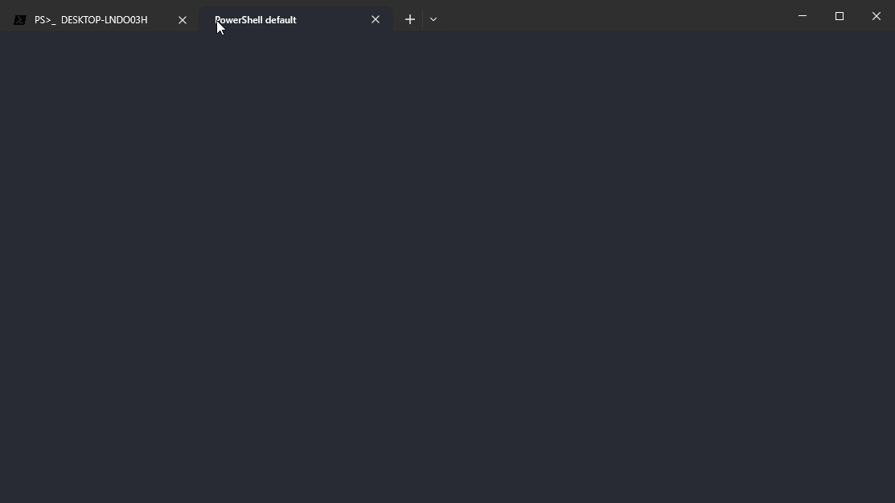
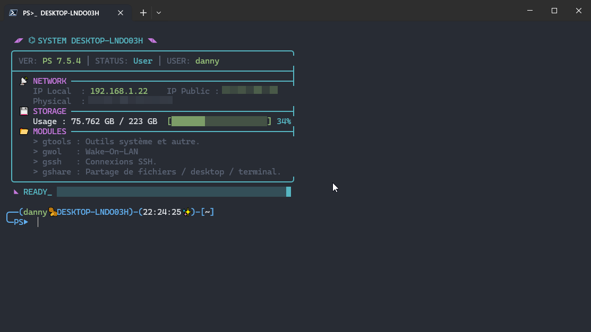

# My-Custom-PowerShell-Profile

Profil PowerShell personnalisé avec fonctions utilitaires, outils système et améliorations du terminal.


---


Ce dépôt contient mon profil PowerShell personnalisé (`$PROFILE` – `Microsoft.PowerShell_profile.ps1`) ainsi qu’un ensemble d’outils, fonctions et alias conçus pour améliorer :

- ✨ **Productivité**
- 🚀 **Confort d’utilisation**
- 🎨 **Esthétique du terminal**
- 🛠️ **Automatisation de tâches courantes**

Tous les outils sont **gratuits**, **ne requière aucune inscription**, et orientés **usage quotidien**, ce projet n'utilise pas "Oh My Posh".

---

## Fonctionnement Général

Le fichier principal `Microsoft.PowerShell_profile.ps1` :

- Vérifie si la session est interactive (sinon, exit).
- Charge les modules depuis les répertoires listés.
- Charge les secrets depuis un fichier `.env` (via `Import-Secrets`).
- Configure des variables globales (icônes, sons, voix, etc.).
- Joue un son d'introduction et une synthèse vocale (1 fois/jour, hors SSH).
- Définit un prompt dynamique (via fonction dans `core/prompt.ps1`).
- Au chargement du profil, un script vérifie si une mise à jour(synchronisation) est disponible (Vérification quotidienne), fichier `.update.lock` pour éviter les mises à jour simultanées (Verrou anti-conflits).
- Lance une mise à jour automatique asynchrone via Git (si dépôt Git présent).
- Charge les groupes d'alias.
- Affiche une bannière d'accueil (via `Show-Banner` dans `core/banner.ps1`) avec infos réseau, stockage, etc.

---

## Prérequis

- Windows 10 / 11
- PowerShell 7.5.4 recommandé
- Git (optionnel)
- Droits administrateur pour certaines fonctionnalités
- Accès Internet pour l'installation des dépendances, l'exposition WAN et les mises à jour.

---

## Installation

Il y a deux méthodes d'utilisation :

1. La méthode avec Git qui permet de modifier le profile directement via git puis de synchroniser les modification vers votre machine soit automatiquement (une mise à jour tous les jours 1 fois par jour), vous ne pouvez donc pas modifier directement le profile vous devez le faire toujours via git si non vos données seront écrasées à la prochaine synchronisation.

2. La méthode simple sans git, (vous pouvez modifier directement le profile).

### Utilisation avec synchronisation Git

1. Installer Git et PowerShell Core :

```powershell
winget install --id Git.Git -e --source winget
winget install --id Microsoft.PowerShell --source winget
```

1. Préparation :

Sauvegarder le contenu de : `$HOME\Documents\PowerShell`, si besoin.

```Powershell
Copy-Item "$HOME\Documents\PowerShell" "$HOME\Documents\PowerShell_Backup" -Recurse
```

Puis supprimer son contenu.

1. Cloner le dépôt :

A cette étape soit vous faites un fork du projet, soit vous le copier directement le projet sur votre dépôt git.

Exemple :

   ```powershell
   git clone https://github.com/DOSSANTOSDaniel/My-Custom-PowerShell-Profile.git $HOME\Documents\PowerShell\
   ```

1. Configurer le fichier des secrets (.env)

Permet de stocker les données sensibles, un exemple de fichier .env :

```
TORTUE_SSH_PORT=xxxx
MAC_PROXMOX=xx:xx:xx:xx:xx:xx
MAC_NEXTCLOUD=xx:xx:xx:xx:xx:xx
TOKEN_MACHINE=xxxxxxxxxxxxxxxxxxxxxxxxxxxxx
```

Ce fichier doit être créé avant de recharger le profile, même s'il est vide au départ si non vous aurez une erreur non bloquante au démarrage.

Par la suite la fonction "Import-Secrets" permet de créer les variables d'environnement correspondantes aux secrets.

Utiliser ces variables dans le code :

```Powershell
function ssh_tortue {
  Connect-MySSH -User "daniel" -IP "192.168.1.85" -Port "$env:TORTUE_SSH_PORT"
}
```

1. Configurer Git sur votre machine :

```powershell
git config --global user.name "VotreNom"
git config --global user.email "email@example.com"
```

2. Autoriser l’exécution des scripts si besoin :

```powershell
Set-ExecutionPolicy RemoteSigned -Scope CurrentUser
```

3. Redémarrer PowerShell (`pwsh`) puis installer les dépendances :

```powershell
installps
```

---

### Utilisation sans Git

Avec cette méthode pas de synchronisation automatique avec git donc pour modifier le profile il faut le faire directement sur les fichiers du profile.

Il faut aussi supprimer le dossier .git s'il est présent.

1. Télécharger le dépôt au format ZIP ou via git clone

2. Sauvegarder le contenu de : `C:\Users\<Nom>\Documents\PowerShell` si besoin puis supprimer son contenu et extraire le fichier compresser dans : `C:\Users\<Nom>\Documents\PowerShell`.

3. Configurer le fichier des secrets (.env)

Permet de stocker les données sensibles, un exemple de fichier .env :

```
TORTUE_SSH_PORT=xxxx
MAC_PROXMOX=xx:xx:xx:xx:xx:xx
MAC_NEXTCLOUD=xx:xx:xx:xx:xx:xx
TOKEN_MACHINE=xxxxxxxxxxxxxxxxxxxxxxxxxxxxx
```

Ce fichier doit être créé avant de recharger le profile, même s'il est vide au départ si non vous aurez une erreur non bloquante au démarrage.

Par la suite la fonction "Import-Secrets" permet de créer les variables d'environnement correspondantes aux secrets.

Utiliser ces variables dans le code :

```Powershell
function ssh_tortue {
  Connect-MySSH -User "daniel" -IP "192.168.1.85" -Port "$env:TORTUE_SSH_PORT"
}
```

1. Installer les dépendances avec :

  ```powershell
  installps
  ```

---

## Organisation des alias

Les alias sont regroupés par catégories logiques :

| Groupe   | Description |
|----------|-------------|
| `gtools` | Outils système & fonctions utilitaires |
| `gwol`   | Réveil réseau (Wake-on-LAN) |
| `gssh`   | Connexions SSH prédéfinies |
| `gshare` | Partage de fichiers, services et sessions |

---

## Alias et commandes du groupe `gtools`

| Alias   | Description                                                                 |
| ------- | --------------------------------------------------------------------------- |
| `chris` | Utilitaire Chris Titus                                                      |
| `disk`  | Gestion des disques                                                         |
| `encrf` | Protection de fichiers par mot de passe aléatoire                          |
| `expose`| Exposer un port sur internet, WAN, (serveo.net, tunnl.gg, localhost.run)  |
| `godm`  | God Mode                                                                   |
| `installps` | Installation des dépendances du profil                                   |
| `maj`   | Mise à jour du système (Windows, Chocolatey, Winget, Scoop)               |
| `majps` | Mise à jour du profil PowerShell                                           |
| `meteo` | Météo des trois derniers jours                                             |
| `ports` | Vérifie les ports en écoute                                                |
| `qclean`| Nettoyage rapide du système                                                |
| `rdisk` | CHKDSK au prochain redémarrage                                             |
| `rwin`  | Réparation automatisée de l’intégrité Windows (DISM + SFC)                |
| `scanip`| Scan des hôtes du réseau LAN                                              |
| `task`  | Gestionnaire des tâches                                                    |

### Aide-mémoire des commandes

| Commandes   | Description                                                   |
| ------- | ------------------------------------------------------------- |
| `appwiz`| Désinstaller ou modifier un programme                         |
| `choco` | Gestionnaire de paquets Chocolatey (search/install/update/uninstall) |
| `control`| Panneau de configuration classique                           |
| `gdu`   | Analyser l’utilisation de l’espace disque                    |
| `mrt`   | Microsoft Malicious Software Removal Tool                    |
| `msinfo`| Informations système                                         |
| `scoop` | Gestionnaire de paquets Scoop (sans admin)                   |
| `winget`| Gestionnaire de paquets Microsoft Winget                     |

---

## Alias `majps`, fonctionnement important

L’alias `majps` permet la synchronisation manuelle entre le profil et un dépôt Git :

- Une synchronisation automatique est lancée une fois par jour au chargement du profil.
- La synchronisation peut être aussi forcée (manuellement) via l'alias `majps`.

---

## Alias du groupe `gshare`

| Alias   | Description                                                                                    |
| ------- | ---------------------------------------------------------------------------------------------- |
| `gofile` | Partage de fichiers WAN (Gofile.io)                                                            |
| `lmsrv`  | Partage d'arborescence de fichiers et dossiers LAN (Miniserve)                                 |
| `lwmsrv` | Partage d'arborescence de fichiers et dossiers LAN (Miniserve) et WAN tunnel (serveo.net, tunnl.gg, localhost.run) |
| `shdesk` | Partage de Desktop WAN (RustDesk)                                                              |
| `shterm` | Partage de terminal WAN (Upterm)                                                               |

---

## Outils utilisés

| Outil                    | Description             | Lien                                                                                             |
| ------------------------ | ----------------------- | ------------------------------------------------------------------------------------------------ |
| Gofile                   | Partage de fichiers WAN | [https://gofile.io/](https://gofile.io/)                                                         |
| Miniserve                | Serveur web léger (LAN) | [https://github.com/svenstaro/miniserve](https://github.com/svenstaro/miniserve)                 |
| Serveo                   | Tunnel réseau WAN       | [https://serveo.net/](https://serveo.net/)                                                       |
| Upterm                   | Partage de terminal WAN | [https://upterm.dev/](https://upterm.dev/)                                                       |
| RustDesk                 | Bureau à distance WAN   | [https://rustdesk.com/fr/](https://rustdesk.com/fr/)                                             |
| Ultimate Windows Utility | Optimisation Windows    | [https://christitus.com/windows-tool/](https://christitus.com/windows-tool/)                     |
| Chocolatey               | Gestionnaire de paquets | [https://chocolatey.org/](https://chocolatey.org/)                                               |
| Scoop                    | Gestionnaire de paquets | [https://scoop.sh/](https://scoop.sh/)                                                           |
| Winget                   | Gestionnaire Microsoft  | [https://winget.run/](https://winget.run/)                                                       |
| PowerShell               | Shell & scripting       | [https://learn.microsoft.com/fr-fr/powershell/](https://learn.microsoft.com/fr-fr/powershell/)   |
| 7-Zip                    | Compression             | [https://www.7-zip.org/](https://www.7-zip.org/)                                                 |
| GDU                      | Analyse disque          | [https://github.com/dundee/gdu](https://github.com/dundee/gdu)                                   |
| Nmap                     | Scan réseau             | [https://nmap.org/](https://nmap.org/)                                                           |
| Git                      | Versioning              | [https://git-scm.com/](https://git-scm.com/)                                                     |
| Windows Terminal         | Terminal moderne        | [https://apps.microsoft.com/detail/9n0dx20hk701](https://apps.microsoft.com/detail/9n0dx20hk701) |
| wttr.in                  | Météo                   | [https://wttr.in/](https://wttr.in/)                                                             |

---

## Détails techniques et fonctionnalitées

- **Prompt** : `core/prompt.ps1`
- **Mise à jour auto** : `scripts/updater.ps1` (verrou anti-conflits)
- **Notifications** : sons + synthèse vocale (`System.Speech`)
- **Bannière** : `core/banner.ps1` (IP, MAC, disque)
- Les alias exposant des services WAN doivent être utilisés **avec prudence**

### Ajouter ou modifier des alias

#### Wake-on-LAN

- Machines : `functions/wol.ps1`
- Alias : `alias/wol_group.ps1`

#### Connexions SSH

- Alias : `alias/ssh_group.ps1`
- Machines : `functions/ssh.ps1`

Même principe pour tous les autres groupes.

---

### Structure du dépôt

```
┌── Microsoft.PowerShell_profile.ps1  # Profil PowerShell
│                                       # Point d’entrée principal (chargement global)
│
├── alias/                            # Alias PowerShell
│                                       # Regroupés par thématiques (outils, partage, SSH, WOL)
│
├── core/
│   ├── banner.ps1                    # Bannière d’accueil
│   │                                   # IP locale/publique, MAC, espace disque, infos système...
│   │
│   └── prompt.ps1                    # Prompt personnalisé
│                                       # Couleurs dynamiques, statut de commandes, contexte...
│
├── functions/                        # Fonctions principales PowerShell réutilisables
│
├── install/                          # Scripts d’installation des dépendances
│   ├── apps/                           # Installation des applications nécessaires
│   ├── services/                       # Installation et configuration de services Windows
│   └── functions/                      # Fonctions utilitaires dédiées à l’installation des dépendances
│
├── scripts/                          # Scripts utilitaires autonomes
│   └── updater.ps1                     # Mise à jour Git asynchrone du profil, synchronisation automatique
│
├── .env                              # Variables sensibles
│                                       # MAC, ports, clés, hôtes (non versionnées)
│
├── .last_update                      # Fichier verrou
│                                       # Limite la mise à jour du profil à 1 fois par jour
│
├── pwsh_music_*_S1.lock              # Fichiers verrou (audio)
│ └── pwsh_voice_*_S1.lock              # Musique / voix d’intro jouées une fois par jour
│
├── updater.log                       # Journal des mises à jour Git du profil
│                                       # Historique et debug
│
└── README.md                         # Documentation du projet
```

### ⚠️ Sécurité et bonnes pratiques

#### Services exposés sur Internet

Les alias `expose`, `lwmsrv`, `shdesk`, `shterm` utilisent des services de tunnelisation tiers :

- **Serveo.net**, **tunnl.gg**, **localhost.run**

- Toujours vérifier la confidentialité des données partagées
- Limiter la durée d'exposition des ports

---

### Fonctions Utilitaires (`functions/`)

Fonctionnalités du Prompt (`core/prompt.ps1`)

Fonction anonyme pour le prompt personnalisé :

- Remplace le chemin home par "~".
- Raccourcit les chemins longs.
- Met à jour le titre de fenêtre dynamiquement (admin, SSH, Upterm).
- Affiche icônes dynamiques (admin, SSH).
- Indique le statut de la dernière commande (succès/échec avec code si applicable).
- Joue un son de notification en cas d'échec.
- Couleurs et icônes aléatoires/custom.

Assert-AppInstalled (`check_installed.ps1`)

- Vérifie si une ou plusieurs apps sont installées. Retourne `$false` si manquante, avec message.

Paramètres : `-Apps` (array de noms d'apps), `-Hint` (message optionnel).

Open-Port (`expose_port.ps1`)

- Expose un port local sur WAN via tunnel SSH (serveo.net, tunnl.gg, localhost.run).
- Vérifie si le port local écoute.
- Teste les serveurs disponibles.

Paramètres : `-LocalPort` (obligatoire), `-Servers` (array de serveurs SSH).

Notifications (`notify.ps1`)

- **Show-Text-Popup** : Popup GUI avec message, titre, type (Info/Warning/Error/Question), boutons, timeout.
- **Show-Voice-Popup** : Synthèse vocale en français (Hortense).
- **Show-Music-Popup** : Joue un fichier WAV.
- **Show-Audio-Popup** : Joue un son système (selon type).

Repair-Disk (`repair_disk.ps1`)

- Planifie CHKDSK au redémarrage ( `/f` pour SSD, `/f /r` pour HDD). Détecte type de disque. Nécessite admin.

Paramètres : `-Drive` (lettre de disque, défaut : système).

Files Server LAN (`share_files_miniserver.ps1`)

- **files_srv_web_lan** : Lance un serveur web Miniserve pour partager le dossier courant en LAN (port 8088 par défaut). Supporte upload, QR code, etc.

Paramètres : `-Port`.

Files Server WAN (`share_files_miniserver_wan.ps1`)

- **files_srv_web_wan** : Lance Miniserve + tunnel SSH pour partage WAN (similaire à LAN, mais exposé via serveurs SSH).

Paramètres : `-Servers` (array de serveurs SSH).

Send-WoL (`wol.ps1`)

- **Send-WoL** : Envoie un Magic Packet Wake-On-LAN.

Paramètres : `-MacAddress`, `-Broadcast`, `-Port`.

Fonctions spécifiques : `wol_proxmox`, `wol_nextcloud` (utilisent secrets comme `$env:MAC_PROXMOX`).

Get-LANInventory (`scan_lan_hosts.ps1`)

- Scanne le réseau LAN via Nmap (ports 22/80/443), liste IP, hostname, OS, ports ouverts, MAC, vendor.

Paramètres : `-Subnet` (défaut : auto-détecté).

Updater (`scripts/updater.ps1`)

- Met à jour le dépôt Git automatiquement (1/jour max, sauf force). Utilise lock pour éviter conflits. Recharge le profil et affiche log si mise à jour.

Paramètres : `-ForceUpdate` (switch pour forcer).

Update System (`scripts/updater.ps1`)

**Fonction :** `Update-Profile`

Gère la mise à jour automatique :

- Vérifie les mises à jour une fois par jour
- Télécharge les changements depuis Git
- Applique les modifications sans redémarrage
- Gère les conflits avec un fichier de verrou

**Utilisation manuelle :**

```powershell
majps  # Force la mise à jour immédiate
```

Notifications

- **Son** : Lecture de `Ring05.wav` au démarrage (Windows Media).
- **Voix** : Synthèse vocale en français via `System.Speech` (uniquement sous Windows PowerShell Desktop, pas pwsh Core).

---

## À faire

- Compatibilité Windows PowerShell 5.x
- Option de désinstallation complète
